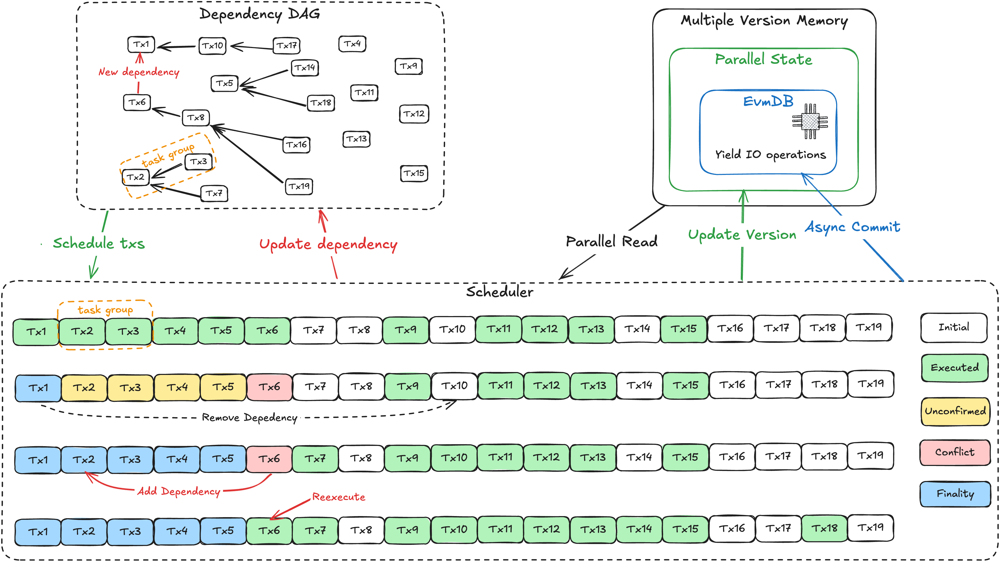
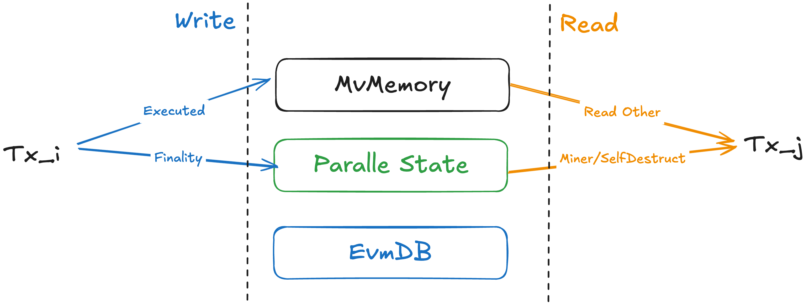

# Grevm 2.1

## **TL;DR – Highlights of Grevm 2.1**

- **Grevm 2.1 achieves near-optimal performance in low-contention scenarios**, matching Block-STM with **11.25
  gigagas/s** for Uniswap workloads and outperforming it with **95% less CPU usage** in inherently non-parallelizable
  cases by **20–30%**, achieving performance close to sequential execution.
- **Breaks Grevm 1.0’s limitations in handling highly dependent transactions**, delivering a **5.5× throughput
  increase** to **2.96 gigagas/s** in **30%-hot-ratio hybrid workloads** by minimizing re-executions through **DAG-based
  scheduling** and **Task Groups**.
- **Introduces Parallel State Store**, leveraging **asynchronous execution result bundling** to **overlap and amortize
  30-60ms of post-execution overhead within parallel execution**, effectively hiding these costs within execution time.
  It also seamlessly handles **miner rewards and the self-destruct opcode** without the performance penalties of
  sequential fallbacks.
- **In-depth analysis of optimistic parallel execution** reveals the **underestimated efficiency of Block-STM** and the
  strength of **optimistic parallelism**, providing new insights into parallel execution.
- **Lock-free DAG** replaces global locks with fine-grained node-level synchronization. Improved scheduling performance
  by 60% and overall performance by over 30% in low conflict situations.

## Abstract

Grevm 2.1 integrates Block-STM with an execution scheduling mechanism based on **Task Groups** and a **Data Dependency
Directed Acyclic Graph (DAG)**, derived from simulated transaction execution results. Unlike Block-STM, which schedules
tasks solely based on the lowest index, Grevm 2.1 dynamically schedules execution based on the DAG, prioritizing
lower-index transactions with no dependencies for parallel execution while grouping strongly dependent transactions into
task groups. Within each task group, transactions execute sequentially within the same thread to minimize re-executions,
reduce scheduling overhead, and optimize CPU utilization. This design significantly reduces transaction re-executions in
high-conflict scenarios and maximizes parallelism by enabling a parallel execution order that mirrors an optimally
reordered sequence—without altering the original transaction order.

Our benchmark results demonstrate that, compared to Grevm 1.0, Grevm 2.1 achieves **5.5× higher throughput** for a
**30%-hot-ratio hybrid workload** (Uniswap, ERC20, and raw transfers), reaching **2.96 gigagas/s**. Additionally, while
Grevm 2.1 matches Block-STM’s performance for low-conflict workloads, it outperforms Block-STM in extreme cases by
maintaining the same performance as sequential execution—avoiding the 20–30% slowdown observed in Block-STM—while using
**95%** less CPU usage.

From an engineering perspective, Grevm 2.1 introduces **parallel state**, an asynchronous state storage mechanism that
bundles final execution results in parallel. This approach elegantly addresses challenges related to miner rewards and
the **self-destruct** opcode without compromising correctness or imposing a performance penalty when falling back to
sequential execution.

In this report, we first present the design of Grevm 2.1 and its benchmark results. Then, we share rarely discussed data
highlighting Block-STM's impressive optimistic execution efficiency, which we discovered during our experiments and
which shaped our key design choices.

## Algorithm Design

Grevm 2.1 consists of three core modules: **Dependency Manager (DAG Manager)**, **Execution Scheduler**, and **Parallel
State Storage**. It employs a DAG-driven task scheduling mechanism to:

1. Dynamically maintain the data dependency DAG using using a **selective update strategy**.
2. Group adjacent dependent transactions into **task groups**.
3. Execute task groups and the lowest-index transactions with no dependencies (i.e., out-degree of 0).



### Dependency Manager and Execution Scheduler

The **Dependency Manager** tracks and resolves transaction dependencies during parallel execution. Like in Grevm 1.0,
transactions are represented in a **Directed Acyclic Graph (DAG)**:

- **Nodes represent transactions**, identified by unique indices. Let $T_i$ be a transaction with index $i$.
- **Edges denote dependencies**, where an edge from $T_j$ to $T_i$ exists if $T_i$ writes data that $T_j$ reads,
  indicating a read-after-write dependency. Notably, $j$ is always strictly less than $i$.

Before execution, dependencies are inferred using **hints**—speculated read/write sets obtained from static analysis or
simulation (executing transactions on the last committed state).

The **Execution Scheduler** manages both transaction **execution** and **validation**, following this workflow:

1. **Parallel Execution**: The scheduler selects and executes transactions with the smallest index from the DAG that
   have no dependencies (out-degree = 0). For a task group, its index is the smallest among all grouped transactions.
2. **Validation**: After execution, transactions enter a **pending** validation phase. The scheduler checks whether the
   read set of the smallest-index pending transaction has changed:
   - If unchanged, the transaction moves to the **unconfirmed** state. Consecutive unconfirmed transactions transition
     into **finality**, starting from the lowest index.
   - If changed, the transaction is marked as a **conflict**, reinserted into the DAG, and its dependencies are updated
     before re-execution.

When consecutive transactions have dependencies, they are grouped into a **Task Group**, which is scheduled and executed
sequentially within the same thread. For example, if $tx_2$ depends on $tx_3$, $tx_2$ must finish before $tx_3$ begins.
By executing them sequentially within a thread, **task groups reduce task switching, re-execution, and scheduling
overhead**, making them highly effective in **high-conflict workloads** like NFT minting and DeFi transactions.

In the worst-case scenario, where all transactions form a dependency chain, **task group execution remains as efficient
as serial execution**. This design **balances optimistic parallelism with efficient CPU utilization**, while maintaining
the simplicity of Block-STM's scheduling logic—avoiding excessive complexity that could degrade performance for simple,
fast-executing transactions, like ERC20 and raw transfers.

### Selective Dependency DAG Update Strategy

Grevm 2.1 follows a **selective dependency strategy**, adding only the most necessary edges to minimize DAG
modifications. Dependencies are added in three scenarios:

1. **Misestimated Reads**: When a transaction reads estimated data that later proves changed, instead of aborting
   immediately and marking it as dependent, Grevm 2.1 completes execution, analyzes the actual read-write set, and adds
   **only the most significant dependency**—specifically, the highest-index transaction it depends on.
2. **Reads from Miner or Self-Destructed Accounts**: If a transaction $T_j$ reads from a **miner account** or a
   **self-destructed account** while the parallel state for $T_{j-1}$ has not yet been committed, instead of linking to
   all prior transactions, Grevm 2.1 adds only $T_{j-1}$ as a dependency, reducing redundant edges.
3. **Validation Phase Conflicts**: If a transaction's read set changes during validation, Grevm 2.1 recalculates
   dependencies and adds only the **most recent transaction** as a dependency. Specifically, if $T_i$ detects a conflict
   with multiple transactions, it finds the one with the **largest index $k$** and adds a dependency edge from $T_k$ to
   $T_i$.

Efficient dependency removal is also crucial for balancing scheduling speed and minimizing re-executions. Dependencies
can be removed at different stages, each with trade-offs:

- **After Execution**: Enables faster scheduling of subsequent transactions but increases the risk of re-execution if
  dependencies were misestimated.
- **After Validation**: Delays scheduling slightly but reduces unnecessary re-executions.
- **After Finality**: Eliminates all re-execution risks but introduces the longest scheduling delay.

Grevm 2.1 adopts a **hybrid Execution + Finality strategy** to achieve an optimal balance:

- **Pre-execution dependencies** (inferred before execution) are removed immediately after execution to maximize
  scheduling throughput.
- **Dynamically detected dependencies** (discovered during execution or validation) are removed only after finality to
  ensure correctness and minimize re-execution.

This strategy ensures efficient scheduling when dependency hints are accurate while mitigating re-execution overhead
when hints are unreliable. Empirical results demonstrate that this hybrid approach effectively balances execution
throughput and re-execution probability, delivering robust performance across diverse workload conditions.

### Parallel State Storage



The **Storage** module implements **DatabaseRef** and provides two key functionalities: **Parallel State** and
**Multi-Version Memory (MvMemory)**. It introduces a **Parallel State** layer between EvmDB and MvMemory to enhance
performance.

After transaction $T_i$ completes execution, its results are stored in **MvMemory**. Once it reaches the **Finality**
state, an asynchronous task commits the results to **Parallel State**. When transaction $T_j$ accesses data, it reads
from **Parallel State** if dealing with a miner or self-destructed account; otherwise, it retrieves data from
**MvMemory**.

This design offers several advantages:

- **Amortized Result State Building**: Transactions continuously generate Reth-compatible result states, eliminating the
  **~30ms latency** of bundling them after full block execution.
- **Efficient State Management**: Since Parallel State implements all
  [EVM State](https://github.com/bluealloy/revm/blob/main/crates/database/src/states/state.rs) interfaces, transactions
  can retrieve the latest miner or self-destructed account state without relying entirely on MvMemory.

In cases where a transaction executes **self-destruct**, conflicts arise if later transactions attempt to access that
account. The self-destruct operation updates MvMemory's write set and marks the account as **self-destructed**. If a
subsequent transaction retrieves self-destructed account data from MvMemory, it must re-fetch the latest state from
Parallel State.

Parallel State's **commit ID** serves as a version number, ensuring that for transaction $j$, only data from version
$j-1$ is valid—otherwise, the transaction is marked as conflicting.

### Lock-free DAG
Grevm 2.0 initially employed a global lock mechanism to ensure correctness in DAG dynamic updates and scheduler operations.
However, benchmark tests (see [Issue 64](https://github.com/Galxe/grevm/issues/64)) revealed that even with the critical
section minimized, performance degraded by over 40%.

To address this, Grevm 2.1 introduces a lock-free DAG solution:

​**​Fine-grained Node Locking​**​: Instead of relying on a global `Mutex`, DAG updates now lock only the relevant nodes. For instance,
when adding a dependency like $tx_j \rightarrow tx_i$, only $tx_j$ and $tx_i$ are locked. **​Atomic Scheduler Cursor​**​: The scheduler
adopts an `Atomic` cursor (`execution_idx`), inspired by Block-STM, to poll for dependency-free nodes in the DAG. Upon completing
$tx_i$, it removes $tx_j$’s dependency and updates the cursor via `execution_idx.fetch_min(j)`. Unlike Block-STM, Grevm cannot
determine validation task scheduling by simply comparing `validation_idx` and `execution_idx`. Execution order may deviate from
transaction sequence (e.g., concurrent execution of tx0 and tx2 while tx1 dependent on tx0, validating tx2 is useless before tx1
is executed). To resolve this, Grevm introduces the `ContinuousDetectSet` module, which uses unsafe methods to verify contiguous
executed transactions.

For ​​asynchronous commits​​ (`StateAsyncCommit`), Grevm handles edge cases like: tx2 and tx4 in unconfirmed state, while tx3 requires
re-execution due to conflicts (triggering a `validation_idx=3` rollback). Under high concurrency, if tx3 re-enters unconfirmed
before tx4 reaches validation, tx4 might commit erroneously. While locks could prevent this, tests show any locking incurs performance
penalties. Instead, Grevm implements a ​​logical timestamp check​​: when `validation_idx` rolls back to $tx_i$, it first acquires a
logical time (`logical_ts.fetch_add(1)`), ensuring any $tx_n$($n≥i$) in unconfirmed state during async commit observes a timestamp
newer than the rollback time.

## Benchmark

We evaluate the Grevm 2.1 implementation with the same setup as 1.0:

- aws c7g.8xlarge 32 vCPUs @2.6 GHz
- Ubuntu 22.04.5 LTS
- cargo 1.81.0 (2dbb1af80 2024-08-20)
- Grevm git commit hash: `15f7134cc434fbd9da63b96b3b23d3f77f9b8fc6`
- pevm git commit hash: `d48fae90b6ad36ddc5d613ee28ad23214353e81e`
- Benchmark code:
  [https://github.com/Galxe/grevm/blob/main/benches/gigagas.rs](https://github.com/Galxe/grevm/blob/main/benches/gigagas.rs)

To reproduce the benchmark, run

```bash
JEMALLOC_SYS_WITH_MALLOC_CONF="thp:always,metadata_thp:always" NUM_EOA=${NUM_EOA} HOT_RATIO=${HOT_RATIO} DB_LATENCY_US=${DB_LATENCY_US} cargo bench --bench gigagas
```

Replace `${NUM_EOA}`, `${HOT_RATIO}`, and `${DB_LATENCY_US}` with the desired parameters:

- `NUM_EOA`: Number of accounts.
- `HOT_RATIO`: Ratio of transactions accessing common ("hot") account.
- `DB_LATENCY_US`: Simulated database latency in microseconds.

### Gigagas Block Test

We conducted the same gigagas block test as 1.0, a benchmark designed to evaluate the efficiency of parallel execution
under varying workloads and conditions. Each mock block contains transactions totaling **1 gigagas** in gas consumption.
The transactions include vanilla Ether transfers, ERC20 token transfers, and Uniswap swaps. Pre-state data is stored
entirely in-memory to isolate execution performance from disk I/O variability. To mimic real-world conditions where disk
I/O latency can impact performance, we introduced artificial latency using the `db_latency` parameter.

### Conflict-Free Transactions

We first evaluated our implementation using conflict-free workloads to measure optimal performance. In this scenario,
transactions consist of independent raw transfers, ERC20 transfers, and Uniswap swaps, each involving separate contracts
and accounts to ensure no data dependencies. This setup provides a baseline to assess the maximum achievable performance
improvement through parallel execution without the impact of transaction conflicts.

| Test            | Num Txs | DB Latency | Sequential | Grevm 1.0 | Grevm 2.1 | Speedup | Gigagas/s |
|-----------------|---------|------------|------------|-----------|-----------|---------|-----------|
| Raw Transfers   | 47620   | 0          | 185.74     | 69.172    | 66.17     | 2.81    | 15.11     |
|                 |         | 20us       | 3703.5     | N/A       | 95.66     | 38.72   | 10.45     |
|                 |         | 40us       | 4654.0     | N/A       | 108.79    | 42.78   | 9.19      |
|                 |         | 60us       | 5612.0     | N/A       | 122.96    | 45.64   | 8.13      |
|                 |         | 80us       | 6560.6     | N/A       | 138.95    | 47.22   | 7.20      |
|                 |         | 100us      | 7511.1     | 179.03    | 155.34    | 48.35   | 6.44      |
| ERC20 Transfers | 33628   | 0          | 329.55     | 96.559    | 65.19     | 5.06    | 15.34     |
|                 |         | 20us       | 5297.6     | N/A       | 120.34    | 44.02   | 8.31      |
|                 |         | 40us       | 6643.3     | N/A       | 138.40    | 48.00   | 7.23      |
|                 |         | 60us       | 7992.8     | N/A       | 158.81    | 50.33   | 6.30      |
|                 |         | 80us       | 9335.1     | N/A       | 182.73    | 51.09   | 5.47      |
|                 |         | 100us      | 10681      | 243.27    | 205.48    | 51.98   | 4.87      |
| Uniswap Swaps   | 6413    | 0          | 771.83     | 108.2     | 88.89     | 8.68    | 11.25     |
|                 |         | 20us       | 12188      | N/A       | 238.91    | 51.02   | 4.19      |
|                 |         | 40us       | 15261      | N/A       | 285.36    | 53.48   | 3.50      |
|                 |         | 60us       | 18378      | N/A       | 336.01    | 54.69   | 2.98      |
|                 |         | 80us       | 21433      | N/A       | 387.18    | 55.36   | 2.58      |
|                 |         | 100us      | 24530      | 439.89    | 439.35    | 55.83   | 2.28      |

_Table 1: Grevm 2.1 Conflict-Free Transaction Execution Speedup (uint = milliseconds)_

Compared to Grevm 1.0, Grevm 2.1 does not achieve the same level of speedup when transaction complexity is low. This is
expected, as DAG-based scheduling incurs higher overhead than 1.0’s partitioning algorithm. However, as transaction
complexity increases, Grevm 2.0’s performance matches and slightly surpasses 1.0. For instance, in the Uniswap swap test
with 100µs access latency, Grevm 2.1 achieves a **60.8× speedup**, compared to 1.0’s **58.06×**. Even in cases where 2.0
is less efficient than 1.0—such as raw and ERC20 transfers—its throughput still significantly exceeds **1 gigagas/s**,
making this trade-off well-suited for production workloads.

Like Grevm 1.0, Grevm 2.1 benefits from **asynchronous I/O**, enabled by parallel execution, further amplifying its
performance advantage over sequential execution.

Additionally, with **parallel state storage**, all tests now include overheads that were excluded in 1.0, such as state
bundling. This explains why the Grevm 1.0 benchmark results referenced here are **end-to-end execution time**, as
reported in Table 3 of the original paper.

### Contention Transactions

We uses the same setup for contention transactions as 1.0, with a **hot ratio** parameter to simulate contention in
transaction workloads. This parameter allows us to model skewed access patterns, where certain accounts or contracts are
accessed more frequently than others.

- **Number of User Accounts**: **100,000** accounts used in the test.
- **Hot Ratio**: Defines the probability that a transaction will access one of the hot accounts.
  - **Hot Ratio = 0%**: Simulates a uniform workload where each read/write accesses random accounts.
  - **Hot Ratio > 0%**: Simulates a skewed workload by designating 10% of the total accounts as **hot accounts**. Each
    read/write operation has a probability equal to the hot ratio of accessing a hot account.

We also introduced a a test set called **Hybrid**, consisting of

- **60% Native Transfers**: Simple Ether transfers between accounts.
- **20% ERC20 Transfers**: Token transfers within three ERC20 token contracts.
- **20% Uniswap Swaps**: Swap transactions within two independent Uniswap pairs.

| Test            | Num Txs | Total Gas     |
| --------------- | ------- | ------------- |
| Raw Transfers   | 47,620  | 1,000,020,000 |
| ERC20 Transfers | 33,628  | 1,161,842,024 |
| Hybrid          | 36,580  | 1,002,841,727 |

_Table 2: Contention Transactions Execution Test Setup_

In Grevm 1.0, the performance of high-contention transactions was constrained by their high interdependence. Grevm 2.1
significantly improves performance in high-conflict scenarios. With a **30% hot ratio**, Grevm 2.1 outperforms 1.0 in
all test cases except for ERC20 transfers with zero latency, where experimental variance is a factor. The most notable
improvement is in the **Hybrid test case**, where Grevm 2.1 achieves a **29× speedup over sequential execution**, which
is **5.55× over Grevm 1.0**, reaching a throughput of **2.96 gigagas/s**.

| Test            | Num Txs | DB Latency | Sequential | Grevm 1.0 | Grevm 2.1 | Total Speedup | ThroughPut(Gigagas/s) |
|-----------------|---------|------------|------------|-----------|-----------|---------------|-----------------------|
| Raw Transfers   | 47620   | 0          | 228.03     | 171.65    | 85.54     | 2.67          | 11.69                 |
|                 |         | 100us      | 8933.0     | 4328.08   | 183.14    | 48.78         | 5.46                  |
| ERC20 Transfers | 33628   | 0          | 366.76     | 92.07     | 88.89     | 4.13          | 11.25                 |
|                 |         | 100us      | 11526      | 438.03    | 226.48    | 50.89         | 4.42                  |
| Hybrid          | 36580   | 0          | 333.66     | 220.14    | 235.33    | 1.42          | 4.25                  |
|                 |         | 100us      | 9799.9     | 1874.7    | 344.88    | 28.42         | 2.90                  |

_Table 3: Grevm 2.1 Contention Transactions Execution Speedup (unit = milliseconds, hot ratio = 30%)_

### Non-Parallelizable Transactions

To compare the performance of Grevm 2.1 and Block-STM in inherently non-parallelizable cases, we conducted a test with
transactions that are highly dependent on each other. In this scenario, transactions form a chain where each transaction
depends on the previous one, making parallel execution impossible. All tests are running with `db_latency = 0`. Same as
Grevm 1.0, we use pevm as the reference implementation for Block-STM.

| Test                  | Num Txs | Sequential | Parallel | Speedup | Gigagas/s | CPU Usage |
| --------------------- | ------- | ---------- | -------- | ------- | --------- | --------- |
| Worst ERC20 Transfers | 33,628  | 350.32     | 369.96   | 0.95    | 2.70      | 128%      |
| Worst Uniswap         | 6,414   | 550.19     | 567.32   | 0.97    | 1.76      | 115%      |

_Table 4: Grevm 2.1 Non-Parallelizable Transactions Test (unit = milliseconds)_

In these tests, Grevm 2.1 experiences only a **5% performance degradation** for ERC20 transfers and **3%** for Uniswap
swaps compared to sequential execution. This result is a significant improvement over Block-STM, which suffers a **~30%
slowdown** in similar scenarios in our benchmark (see Table 5), aligning with the worst-case benchmark results reported
in the Block-STM paper.

A more impressive result is the **CPU usage**, sampled using `pidstat`. Grevm 2.1 uses only **128% CPU for ERC20
transfers** and **115% CPU for Uniswap swaps**, whereas Block-STM consumes **2987% and 2761% CPU**, respectively. This
represents a **95% reduction in CPU usage** compared to Block-STM. These findings highlight Grevm 2.1's efficiency in
handling inherently non-parallelizable transactions, enhancing the execution engine's resilience against worst-case
transaction dependencies.

| Test          | Num Txs | Sequential Total | Grevm Parallel | Speedup | Gigagas/s | CPU Usage |
| ------------- | ------- | ---------------- | -------------- | ------- | --------- | --------- |
| Worst ERC20   | 33,628  | 292.45           | 423.45         | 0.69    | 2.36      | 2987%     |
| Worst Uniswap | 6,414   | 488.12           | 687.13         | 0.71    | 1.46      | 2761%     |

_Table 5: Block-STM (pevm implementation) Non-Parallelizable Transactions Test (unit = milliseconds)_

## Comparison, Analysis, and Future Work

### Optimistic Parallelism (Block-STM) Is MORE Efficient Than Expected

In parallel block execution, the dependencies between transactions play a crucial role in system performance. To
quantify this impact, we introduce two key metrics: **Dependency Distance** and **Dependent Ratio**. If a transaction
$T_j$ depends on a preceding transaction $T_i$, their dependency distance is defined as:

```math
\text{dependency\_distance} = j - i
```

where $j$ and $i$ are the transaction indices. The number of transactions within a block that have dependencies is
denoted as `with_dependent_txs`, and the dependent ratio is given by:

```math
\text{dependent\_ratio} = \frac{\text{with\_dependent\_txs}}{\text{block\_txs}}
```

where **block_txs** represents the total number of transactions in the block. The following figure illustrates the
relationship between conflict rate and dependency distance under **fully optimistic execution**, based on a **1
Gigagas** block containing **47,620** normal transfer transactions:


The analysis reveals that even when **dependency_distance = 1**, later transactions still have a certain probability of
reading the correct data from earlier ones. When **dependency_distance ≥ 4**, conflict rates drop significantly, showing
an approximately inverse relationship with dependency distance.

This insight is highly practical: even in blocks with a high number of interdependent transactions, optimistic execution
strategies (such as **Block-STM**) do not necessarily lead to excessive transaction re-execution. This is because
transactions with greater dependency distances are less likely to conflict, minimizing performance degradation caused by
re-executions. Moreover, when simple transactions—such as raw transfers and ERC20 transfers—are executed quickly, later
transactions are more likely to read correct data from earlier ones. This happens because earlier transactions may have
already completed execution, even when later transactions are running in parallel. Furthermore, if transaction
reordering is an option, interleaving transactions with gapped dependencies can significantly improve optimistic
parallelism by minimizing conflicts caused by short dependency distances.

This principle provides us the theoretical foundation for optimizing parallel execution engines, enabling maximum
performance while ensuring correctness. For transactions with **short dependency distances (dependency_distance ≤ 3)**,
a more conservative scheduling strategy (e.g., **Task Group**) can help reduce conflicts. Meanwhile, transactions with
**larger dependency distances** can be processed using fully optimistic execution to maximize parallelism and
throughput.

### Implications of Dependency Distance on DAG Scheduling

When `dependency_distance` is large enough, hints and the dependency DAG play a less critical role, as transactions can
be optimistically executed in parallel with minimal risk of re-execution. However, when it is small (e.g., $≤ 3$), the
likelihood of conflicts increases, leading to frequent re-execution of affected transactions. Without dynamic dependency
updates, some conflicting transactions may require over 10 execution attempts before confirmation. Introducing dynamic
updates to the dependency DAG can significantly reduce the number of retries:

- **Execution-phase updates**: Lowers retries to about 5.
- **Validation-phase updates**: Further reduces retries to around 3.
- **Finality-phase updates**: Limits retries to at most 2.

Both dependency updates and transaction re-executions introduce overhead, requiring a balance where
`dependency_distance` serves as the primary optimization metric.

In high-conflict scenarios, hints accuracy becomes particularly important. When hints are reliable, even execution-phase
dependency removals can prevent conflicts, enabling faster scheduling. Conversely, inaccurate hints lead to frequent
dependency DAG updates, degrading performance.

Task Group mechanism also mitigates reliance on hints accuracy. To ensure less-conflict execution even when hints are
inaccurate, only transactions with `dependency_distance = 1` are grouped into task groups, preserving sequential
execution and minimizing performance loss.

Overall, Grevm 2.1 offers no major advantage over Block-STM in low-conflict scenarios. However, in high-conflict
environments, Grevm 2.1 significantly reduces retries (lowering CPU consumption) and optimizes execution based on
`dependency_distance` when hints are reliable.

### Validation Scheduling

In Grevm 2.1, validation scheduling is slower than in Block-STM for two key reasons.

The first is straightforward: Grevm 2.1 does not execute transactions strictly in index order, whereas validation must
proceed sequentially. As a result, validation often stalls, waiting for earlier transactions to complete before it can
proceed, causing scheduling delays.

The second reason stems from an often-overlooked Block-STM optimization for validation. Block-STM introduces a
`write_new_locations` flag for each transaction, indicating whether transactions have written to a new memory location.
If a transaction encounters a conflict, `validation_idx` advances immediately to `tx + 1`, meaning validation does not
need to wait for the conflicting transaction to be re-executed. After re-execution, if `write_new_locations = false`,
only a single validation task is required, and `validation_idx` remains unchanged. It only advances when
`write_new_locations = true`. Since this flag is rarely `true` after a retry, Block-STM efficiently accelerates
validation by avoiding unnecessary re-validations for non-conflicting transactions.

Since validation is a prerequisite for finality, and features like remove dynamic dependency, async-commit, miner, and
self-destruct all depend on finality, optimizing Grevm 2.0’s validation speed is critical.

A simple approach would be to validate transactions immediately after execution, following Block-STM’s strategy of
checking the `write_set` of earlier transactions. However, this method also requires scanning the `read_set` of later
transactions, which is computationally expensive. Checking the `write_set` of earlier transactions involves verifying
only the latest written location, whereas checking the `read_set` of later transactions requires scanning all subsequent
transactions to confirm they accessed the correct data—an inefficient process.

A more effective solution is to validate a transaction’s `write_set` and, if its modifications exceed the predicted
range of hints, handle those out-of-range transactions using the standard validation process. However, for transactions
within the hints range, their read/write sets do not require validation. Thus, optimizing Grevm 2.0’s validation speed
relies heavily on hints accuracy. By dynamically refining hints and improving the validation mechanism, the system can
significantly enhance performance while maintaining correctness.

### Future Work

Based on the above analysis, we propose several directions for future research:

1. **More efficient dependency DAG management.** Our findings indicate that using a single lock—whether Rust’s standard
   locks or a high-performance implementation like `parking_lot`—can reduce scheduler and overall performance by
   **10-20% (~20ms, depending on transaction count and execution time).**, comparing with Block-STM's neat atomic index
   counter, To address this, we plan to investigate lock-free data structures to enhance the DAG manager’s efficiency.
2. **Optimizing validation.** Inspired by Block-STM’s `write_new_locations` flag, we aim to develop more efficient
   validation algorithms using sophisticated, high-performance data structures to minimize unnecessary re-validations.
3. **Empirical hints accuracy analysis.** We plan to conduct a comprehensive study on hints accuracy to determine the
   optimal balance between hints-based scheduling and dynamic dependency updates, based on real-world data from EVM
   blockchains like Ethereum, BNB chain, and Base.

## Authors

- [https://github.com/AshinGau](https://github.com/AshinGau)
- [https://github.com/nekomoto911](https://github.com/nekomoto911)
- [https://github.com/Richard](https://github.com/Richard19960401)
- [https://github.com/stumble](https://github.com/stumble)
